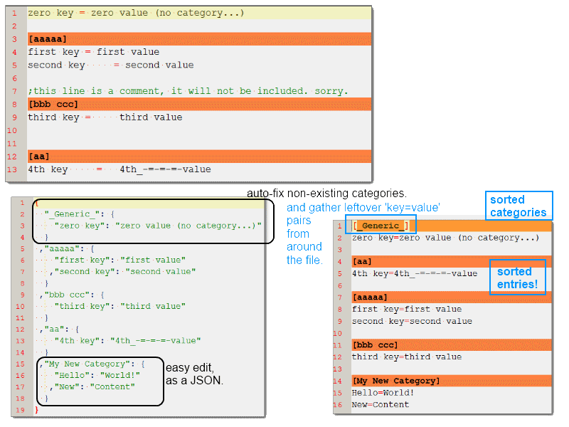

<h1>ini.js</h1>
an easy middleware-convertor, converting INI-files to a JSON-object,  
edit it as you normally would edit a native JavaScript object,  
and then write it back to INI.  
  

This can help you integrate old INI-configuration files to your newer NodeJS programs,  
or even a helping tool to convert old INI-files to a newer JSON format.  

Supports back and forth convention.  
Supports UTF-8 content.  

Additional (optional) methods added,  
including argument handling, file read/write (JSON too) to make things easier/faster.

<h3>No support for commented-lines (with <code>;</code>) since JSONs do not have native support for 'non-data' storing.. feel free to fork and implement one...</h3>